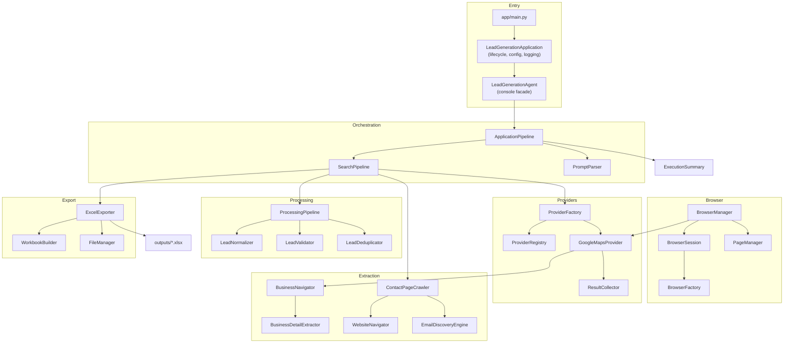
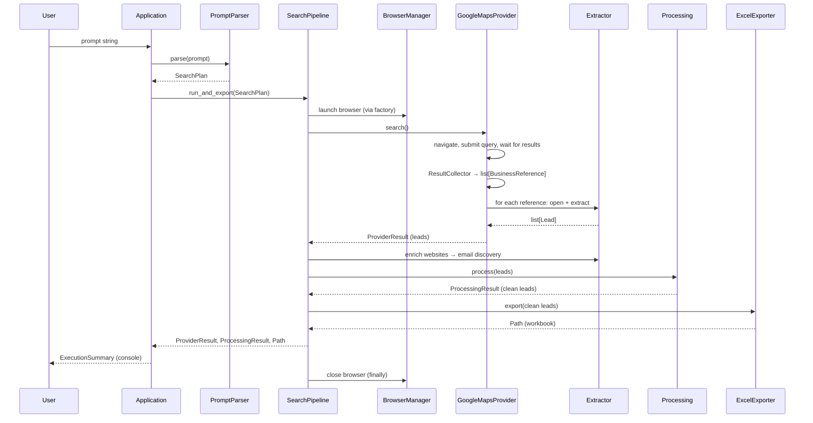

# DEVELOPER_GUIDE.md

**Lead Generation Agent — Architecture, Engineering, and Extension Guide**

This document explains the complete architecture, design decisions, coding
standards, and extension points of the project for software engineers who want
to understand, maintain, or extend it. It is written against the **actual
implementation** — no feature is described that does not exist in the code.

> Table of contents:
> 1. [Project Overview](#1-project-overview)
> 2. [System Architecture](#2-system-architecture)
> 3. [Directory Structure](#3-directory-structure)
> 4. [Module Responsibilities](#4-module-responsibilities)
> 5. [Data Flow](#5-data-flow)
> 6. [Data Models](#6-data-models)
> 7. [Design Patterns](#7-design-patterns)
> 8. [Error Handling](#8-error-handling)
> 9. [Configuration](#9-configuration)
> 10. [Browser Automation](#10-browser-automation)
> 11. [Search Provider Architecture](#11-search-provider-architecture)
> 12. [Extraction Pipeline](#12-extraction-pipeline)
> 13. [Export Pipeline](#13-export-pipeline)
> 14. [Testing Architecture](#14-testing-architecture)
> 15. [Adding New Features](#15-adding-new-features)
> 16. [Coding Standards](#16-coding-standards)
> 17. [Performance Considerations](#17-performance-considerations)
> 18. [Security Considerations](#18-security-considerations)
> 19. [Known Limitations](#19-known-limitations)
> 20. [Future Roadmap](#20-future-roadmap)
> 21. [Architecture Decisions](#21-architecture-decisions)
>
> Final sections: [Developer Checklist](#developer-checklist) ·
> [Code Review Checklist](#code-review-checklist) ·
> [How to Contribute](#how-to-contribute) ·
> [Project Maintenance Guidelines](#project-maintenance-guidelines)

---

## 1. Project Overview

### Purpose

The Lead Generation Agent turns a single natural-language prompt — e.g.
**"software companies in Karachi"** — into a formatted Excel workbook of
business leads (name, email, phone, website, location). It does this with real
browser automation, so no third-party APIs or API keys are required.

### High-Level Architecture

The project is a **layered, single-responsibility Python application**:

```text
Entry point → Application (lifecycle) → Agent (console) → Pipeline (orchestration)
   → Parser → Browser → Provider → Extractor → Processing → Exporter → Summary
```

Each layer depends only on the layers below it, communicates through small
data models, and is constructed through **constructor dependency injection**,
which makes every component independently testable.

### Development Philosophy

1. **Deterministic and dependency-light.** Prompt parsing is regex-based; no
   external AI/LLM services are required at runtime (Offline Mode works with no
   network).
2. **Single responsibility.** Each module does one thing; nothing in the
   browser layer knows about extraction, nothing in extraction knows about
   Excel.
3. **Never crash on bad data.** Missing or malformed data becomes empty
   strings or is skipped; one failing business never aborts the run.
4. **Failures are contained and observable.** Every failure is caught, logged,
   and surfaced through an `ExecutionResult` instead of an unhandled traceback.
5. **Testability first.** Dependency injection plus fakes allow the whole
   workflow to be tested offline.

### Project Goals

- Satisfy the 14 assignment requirements (all PASS, see
  `docs/REQUIREMENT_COMPLIANCE.md`).
- Be modular enough that providers, exporters, extractors, and processing
  stages can be swapped or added without touching the orchestration layers.
- Ship with a complete, fast, offline-capable test suite (483 tests).

---

## 2. System Architecture

### Layered Flow

```text
User Input
    ↓
Prompt Parser           app/parser
    ↓
Search Plan             app/models
    ↓
Application Pipeline    app/pipeline
    ↓
Browser Manager         app/browser
    ↓
Provider                app/providers
    ↓
Business Discovery      app/providers (ResultCollector)
    ↓
Business Extraction     app/extractor
    ↓
Website Email Discovery app/extractor
    ↓
Data Processing         app/processing
    ↓
Excel Export            app/exporter
    ↓
Execution Summary       app/utils
```

### Mermaid Architecture Diagram



### Layer Responsibilities

| Layer             | Responsibility                                                          |
| ----------------- | ----------------------------------------------------------------------- |
| `main.py`         | Bootstrap; forwards the optional prompt argument.                       |
| `application`     | Load/validate configuration, initialize logging, run agent, exit code.  |
| `agent`           | Autonomous agent loop: console facade, planner, executor, tool manager, memory/state. |
| `pipeline`        | Legacy orchestrator (parse → search → process → export → summarize); exposed as the `pipeline` tool. |
| `parser`          | Converts a prompt into a `SearchPlan`.                                  |
| `browser`         | Owns the Playwright lifecycle (launch, context, page, close).           |
| `providers`       | Search providers, registry/factory, and result discovery.               |
| `extractor`       | Reads contact data from listing pages and websites.                     |
| `processing`      | Normalizes, validates, and deduplicates leads.                          |
| `exporter`        | Builds and saves the Excel workbook.                                    |
| `models`          | Data carriers (`Lead`, `SearchPlan`, `ExecutionResult`, …).             |
| `config`          | Settings, constants, logging configuration.                             |
| `utils`           | Helpers, execution summary, retry/timer utilities.                      |
| `exceptions`      | Single exception hierarchy rooted at `LeadGenerationError`.             |

---

## 3. Directory Structure

```
Lead_Generation_Agent/
├── app/                          # All application source code
│   ├── main.py                   # Entry point
│   ├── application/              # Lifecycle orchestration
│   ├── agent/                    # Planner, executor, tool manager, memory, state
│   ├── browser/                  # Playwright lifecycle
│   ├── config/                   # Settings, constants, logging
│   ├── exceptions/               # Exception hierarchy
│   ├── exporter/                 # Excel export
│   ├── extractor/                # Business + email extraction
│   ├── gui/                      # PySide6 desktop GUI
│   ├── llm/                      # Unified LLM gateway (Free LLM Router) + offline mock
│   ├── models/                   # Data models
│   ├── parser/                   # Prompt parsing
│   ├── pipeline/                 # Legacy orchestration
│   ├── processing/               # Normalize/validate/deduplicate
│   ├── providers/                # Search providers, registry, factory
│   ├── tools/                    # 13-tool registry and wrappers
│   └── utils/                    # Helpers, summary, retry, timer
├── tests/                        # 483 tests (unit/integration/E2E/requirement)
├── docs/                         # Architecture, compliance, summary, guides
├── outputs/                      # Generated .xlsx workbooks (git-ignored)
├── logs/                         # Rotating application logs (git-ignored)
├── .env.example                  # Environment variable template
├── .gitignore
├── .python-version               # Python version hint (3.14)
├── pyproject.toml                # Packaging, tooling, pytest config
├── requirements.txt              # Runtime dependencies
├── README.md                     # End-user guide
└── RUN_GUIDE.md                  # Beginner run guide
```

### Why Each Directory Exists

| Directory         | Why it exists                                                                 |
| ----------------- | ----------------------------------------------------------------------------- |
| `app/`            | Isolates all production code from tests, docs, and generated files.           |
| `application/`    | Keeps process-level concerns (config, logging, exit codes) out of business logic. |
| `agent/`          | Hosts the agent loop (planner, executor, tool manager, memory, state) plus the console facade. |
| `browser/`        | Encapsulates all Playwright lifecycle code behind one small public API.       |
| `config/`         | Centralizes settings/constants so values are never hardcoded in modules.      |
| `exceptions/`     | Provides a single catchable hierarchy (`LeadGenerationError`).                |
| `exporter/`       | Keeps workbook construction and file naming independently testable.           |
| `extractor/`      | Groups page navigation and field extraction for both listings and websites.   |
| `models/`         | Defines the typed contracts passed between layers.                            |
| `parser/`         | Isolates the deterministic prompt→plan translation.                           |
| `pipeline/`       | Orchestrates the workflow and contains failures at the right boundary.        |
| `processing/`     | Keeps data-cleaning rules (normalize/validate/dedupe) independent of sources. |
| `providers/`      | Encapsulates search-source strategy and provider registration.                |
| `utils/`          | Reusable, layer-agnostic helpers.                                             |
| `tests/`          | Mirrors the app structure; keeps the suite offline via fakes.                 |
| `docs/`           | Holds architecture and compliance documentation for reviewers.                |
| `outputs/`        | Runtime artifact location (Excel files), git-ignored.                         |
| `logs/`           | Runtime artifact location (rotating logs), git-ignored.                       |

---

## 4. Module Responsibilities

| Module | Responsibilities | Inputs | Outputs | Dependencies | Future extensions |
| ------ | ---------------- | ------ | ------- | ------------ | ----------------- |
| `LeadGenerationApplication` (`application/application.py`) | Load & validate settings, prepare directories, configure logging, run the agent, map result → exit code (0 success / 1 failure), catch unexpected errors. | optional `prompt`, injected `settings`/`factory` | `int` exit code | `LeadGenerationAgent`, `configure_logging`, `Settings` | Different logging backends, health checks |
| `LeadGenerationAgent` (`agent/lead_generation_agent.py`) | Print banner, read prompt from console when omitted, run `ApplicationPipeline`, print completion lines. | `prompt: str \| None` | `ExecutionResult` | `ApplicationPipeline`, `Console`, `Settings`, `ProviderFactory` | Slots/web UIs, progress reporting |
| `PromptParser` (`parser/prompt_parser.py`) | Split prompt into business type and location using `in`/`near`/`around`; build a `SearchPlan` from settings. | `prompt: str`, optional `Settings` | `SearchPlan` or `ParserException` | `SearchPlan`, `Settings`, `ParserException` | spaCy/LLM parsing, multi-location support |
| `SearchPipeline` (`pipeline/search_pipeline.py`) | Run a provider's lifecycle, enrich leads via website email discovery, process, and export; guarantee provider+browser release in `finally`. | `SearchPlan` | `ProviderResult`; `process_leads()`, `export_leads()`, `run_and_export()` | `ProviderFactory`, `ContactPageCrawler`, `ProcessingPipeline`, `ExcelExporter`, `FileManager` | New enrichment steps, parallel exports |
| `BrowserManager` (`browser/browser_manager.py`) | Public façade over the browser lifecycle: launch, new_page, active_page, navigate_to, close, is_running. | commands | `Page` / `None` | `BrowserFactory`, `BrowserSession`, `PageManager` | Page pooling, proxy config |
| `GoogleMapsProvider` (`providers/google_maps_provider.py`) | Concrete provider: open Google Maps, submit query, wait for results, collect references, open each listing, extract leads. | `SearchPlan` (via `BaseProvider`) | `references`/`leads` properties | `BaseProvider`, `ResultCollector`, `BusinessNavigator`, `BusinessDetailExtractor`, provider exceptions | Retry per listing, captcha handling |
| `BusinessNavigator` (`extractor/business_navigator.py`) | Open a listing URL and wait for a detail container to render. | `BusinessReference`, `Page` | `Page`; raises `ExtractionException` | `Settings`, `ExtractionException` | Smart waits, consent banners |
| `BusinessDetailExtractor` (`extractor/business_detail_extractor.py`) | Read name, phone, website, location, email from an opened listing page; missing fields become `""`. | `Page`, `BusinessReference`, `search_query` | `Lead` | Playwright `Page`, models | Social links, hours, reviews |
| `EmailDiscoveryEngine` (`extractor/email_discovery_engine.py`) | Find the first valid email via six strategies in priority order: mailto links, page text, footer, header, contact sections, JSON-LD. | `Page` | `str` (email or `""`) | `EmailValidator` | DNS/MX verification, obfuscated-email decoding |
| `ContactPageCrawler` (`extractor/contact_page_crawler.py`) | Enrich a lead with an email: open the website, then crawl contact/about pages (bounded: depth 2, max 5 pages). | `Lead`, `Page` | `str` (email or `""`) | `WebsiteNavigator`, `EmailDiscoveryEngine` | Sitemap crawling, link-text expansion |
| `LeadNormalizer` (`processing/lead_normalizer.py`) | Clean every field: collapse whitespace, lowercase email, canonicalize website, flatten phone to digits with optional `+`. Never mutates input. | `Lead` | `Lead` (copy) | `dataclasses.replace`, `urllib.parse` | More aggressive URL/phone cleaning |
| `LeadValidator` (`processing/lead_validator.py`) | Structural checks: non-empty name required; present website/email/phone must be well-formed; missing optional fields are OK. | `Lead` | `ValidationResult` | `EMAIL_PATTERN`, models | Real email MX checks |
| `LeadDeduplicator` (`processing/lead_deduplicator.py`) | Remove duplicates by strongest signal: website → name+location → phone. Keep first occurrence. | `list[Lead]` | `DeduplicationResult` | models | Fuzzy name matching |
| `ProcessingPipeline` (`processing/processing_pipeline.py`) | Orchestrate normalize → validate → deduplicate; skip unusable leads; report statistics. | `list[Lead]` | `ProcessingResult` | `LeadNormalizer`, `LeadValidator`, `LeadDeduplicator` | Additional stages (scoring, geocoding) |
| `ExcelExporter` (`exporter/excel_exporter.py`) | Coordinate workbook construction and saving; wrap save failures as `ExportException`. | `list[Lead]`, `business_type`, `location` | `Path` | `WorkbookBuilder`, `FileManager`, `ExportException` | Multiple formats behind one interface |
| `WorkbookBuilder` (`exporter/workbook_builder.py`) | Build the formatted workbook: `Leads` sheet, bold header, frozen pane, auto-sized columns. | `list[Lead]` | `openpyxl.Workbook` | `openpyxl` | Styling options, multiple sheets |
| `FileManager` (`exporter/file_manager.py`) | Generate safe filenames (`leads_<type>_<location>.xlsx`), append a timestamp on collision, ensure the directory exists. | `business_type`, `location` | `Path` | `ensure_directory`, `ExportException` | S3/GCS destinations |

---

## 5. Data Flow

### How Data Moves Through the Application

```text
User Prompt
    ↓  (string)
SearchPlan                     parsed prompt + provider + max_results
    ↓
BusinessReference              discovered listing (id, name, url, index, provider)
    ↓
Lead                           extracted contact data (5 fields + metadata)
    ↓
Processed Lead                 normalized + validated + deduplicated Lead
    ↓
Excel Workbook                 formatted .xlsx written to outputs/
```

### Mermaid Sequence Diagram



---

## 6. Data Models

All models live in `app/models/`. Most are **frozen dataclasses with `slots`**,
so they are immutable, hashable, and memory-efficient.

| Model | Fields | Why each field exists |
| ----- | ------ | --------------------- |
| `SearchPlan` | `original_prompt`, `business_type`, `location (None)`, `provider ("google")`, `max_results (10)` | The single structured instruction that drives the whole run. `original_prompt` preserves the user's exact input; `business_type`/`location` drive the search query; `provider` selects the strategy; `max_results` bounds the work. Validated in `__post_init__` (non-empty, positive). |
| `ParsedQuery` | `business_type`, `location (None)` | A lightweight legacy model of a parsed prompt. Note: production parsing produces a `SearchPlan`; `ParsedQuery` is defined, exported, and unit-tested but **not used by the runtime pipeline**. Kept as a simple representation for future parsers. |
| `BusinessReference` | `business_id`, `business_name`, `listing_url (None)`, `listing_index (0)`, `provider ("")` | Identifies one discovered listing without contact data. `business_id`/`listing_url` provide stable deduplication keys (`dedupe_key` prefers URL → id → name); `listing_index` preserves discovery order; `provider` records the source. Validated in `__post_init__`. |
| `Lead` | `business_name`, `phone_number`, `email`, `website`, `location`, `provider`, `search_query`, `source_url`, `collected_at (datetime)` | The core record. Missing optional fields default to `""` (never crash, Requirement 7). `collected_at` timestamps the record; `provider`/`search_query`/`source_url` give provenance. Helpers: `with_email()` (never overwrites an existing email), `has_*()` predicates, `is_valid()` (name-only structural check). |
| `ExecutionResult` | `search_query`, `business_type`, `location (None)`, `provider`, `requested_leads`, `collected_leads`, `processed_leads`, `duplicates_removed`, `excel_output_path (None)`, `execution_time`, `success` | Describes a completed run end to end. Counts let the summary report what happened at each stage; `excel_output_path` is `None` on failure; `success` drives the CLI exit code and the summary styling. |

Supporting models:

- `ProviderResult` (`app/providers/provider_result.py`) — frozen dataclass
  summarizing one provider run: `business_references`, `leads`, metadata,
  `execution_time`, `success`, `query`, `provider_name`, plus `business_count`
  and `lead_count` properties.
- `ValidationResult` (`processing/lead_validator.py`) — `is_valid: bool`,
  `reason: str`.
- `DeduplicationResult` (`processing/lead_deduplicator.py`) — `leads`,
  `duplicates_removed`, `removed` (names).
- `ProcessingResult` (`processing/processing_pipeline.py`) —
  `input_count`, `valid_count`, `invalid_count`, `duplicates_removed`, `leads`,
  and `final_count`.
- `LaunchResult` (`browser/browser_factory.py`) — the started Playwright
  runtime and browser.

---

## 7. Design Patterns

| Pattern | Where used | Why it was chosen |
| ------- | ---------- | ----------------- |
| **Dependency Injection (constructor)** | Throughout: `BrowserManager`, `ProviderFactory`, `SearchPipeline`, `ProcessingPipeline`, `ExcelExporter`, `ContactPageCrawler`, `GoogleMapsProvider`, `ApplicationPipeline`, `LeadGenerationAgent` | Every collaborator can be swapped in tests (fakes) and in future versions without touching callers. It is the backbone of the offline test suite. |
| **Factory Pattern** | `ProviderFactory` (creates providers from a plan + registry), `BrowserFactory` (creates a launched browser), `build_fixed_factory` in tests | Decouples construction from use and centralizes dependency wiring (e.g. the browser is owned by the factory and shared with providers). |
| **Registry Pattern** | `ProviderRegistry` + module-level `provider_registry` singleton | Providers register themselves by name; the rest of the app resolves them without knowing concrete classes. Enables pluggable strategies and test registries. |
| **Pipeline Pattern** | `ProcessingPipeline` (normalize→validate→dedupe), `SearchPipeline`, `ApplicationPipeline` | Each stage is a small, independently testable component; stages can be reordered, injected, or extended; failures are contained at the stage boundary. |
| **Strategy Pattern** | `BaseProvider`/`GoogleMapsProvider`/`SearchProvider` | Providers are interchangeable strategies selected by `SearchPlan.provider`; new search sources slot in without touching the pipeline. |
| **Builder Pattern** | `WorkbookBuilder` | Workbook construction (headers, styling, sizing) is separated from the export orchestration so formatting logic is testable in isolation. |
| **Abstract Base Class** | `BaseProvider` (`ABC`, abstract `initialize/search/collect_results/close`) | Defines a mandatory provider contract enforced at class-definition time. |
| **Facade Pattern** | `BrowserManager` (hides factory+session+page manager), `LeadGenerationAgent` (hides the pipeline) | Present a small, stable public API over more complex subsystems. |
| **Context Manager** | `Timer` in `app/utils/timer.py` | Measured code blocks with automatic elapsed-time logging. |
| **Singleton-ish** | `get_settings()` (`@lru_cache(maxsize=1)`), `provider_registry` | One process-wide settings instance and one provider registry, consistent with the app being a single-run CLI. |
| **Repository Pattern** | **Not implemented** | There is no persistence layer or database; the closest analog is `ResultCollector` (data discovery) and `FileManager` (output storage). Add this pattern if a database is introduced (see roadmap). |

---

## 8. Error Handling

### Custom Exception Hierarchy

All custom exceptions inherit from `LeadGenerationError`
(`app/exceptions/`), so callers can catch the whole application error family:

```text
LeadGenerationError
├── BrowserException
├── ExportException
├── ExtractionException
├── ParserException
└── ProviderException
    ├── UnknownProviderError
    ├── DuplicateProviderError
    ├── ProviderInitializationError
    ├── ProviderSearchError
    │   ├── ProviderNavigationError
    │   └── ProviderElementNotFoundError
```

### Retry Strategy

- A generic `retry` decorator exists in `app/utils/retry.py`
  (exponential backoff, configurable attempts/delay/exceptions) and is covered
  by unit tests.
- **Honest note:** the decorator is **not currently wired into any production
  flow**. Failed website visits and provider steps are currently *skipped* and
  logged rather than retried. Wiring `@retry` into enrichment/collection is an
  obvious future improvement.

### Graceful Degradation

| Boundary | Behavior |
| -------- | -------- |
| `ApplicationPipeline.execute` | Catches **any** exception from the run, logs it, and returns an unsuccessful `ExecutionResult` instead of crashing. |
| `SearchPipeline.run` | `finally` block always releases the provider and the factory's browser, even when the run fails. |
| `GoogleMapsProvider._extract_leads` | One business that fails to open/extract is logged and skipped; the rest are processed. |
| `SearchPipeline._enrich_leads` | A website that cannot be opened leaves that lead unchanged and continues. |
| `ContactPageCrawler.crawl` | Navigation failures on candidate pages are logged and skipped; crawl is bounded (depth 2, 5 pages). |
| `ProcessingPipeline` | Normalization/validation failures keep the lead out of the result but never stop the pipeline. |
| `ResultCollector` | Scroll/wait failures are treated as stalled scrolls and terminate collection gracefully. |

### Missing Data Handling

- Every optional field defaults to `""` in `Lead` (Requirement 7).
- Extractors return `""` for unreadable fields (never raise for a missing
  field).
- The workbook writes empty strings as blank cells.
- `LeadValidator` accepts missing optional fields; only the business name is
  required.

### Logging Strategy

- Configured once in `configure_logging(settings)` (`app/config/logging_config.py`).
- Two handlers on the root logger: a **colored console** handler (Rich when
  available, plain otherwise) and a **rotating file** handler
  (`logs/application.log`, 5 MB, 3 backups).
- `get_logger(name)` returns children of the shared `lead_generation_agent`
  logger so all modules share the handlers.
- Modules log via injected `logger=` parameters (falling back to
  `get_logger(...)`), which keeps tests deterministic and enables fake
  loggers.

---

## 9. Configuration

### `app/config/constants.py`

Centralizes all magic values: project root, app name/version, logger/handler
names, default env file, default output/log dirs, log filename/size/backups,
log format, defaults for every setting, supported providers, and supported
browsers.

### `app/config/settings.py`

- `Settings` — an **immutable, frozen, slotted dataclass** with fields
  `headless`, `timeout`, `max_leads`, `search_provider`, `output_dir`,
  `log_dir`, `log_level`, `browser_type`.
- `Settings.from_env(env_file=None)` — loads a `.env` (via `python-dotenv`,
  non-overriding) and reads typed env vars with strict parsers:
  `_env_str`, `_env_bool` (accepts `1/true/yes/on` and `0/false/no/off`,
  raises otherwise), `_env_int` (raises on non-integer), `_env_path` (relative
  paths resolve against the project root).
- `Settings.validate()` — collects **all** problems at once: positive
  `timeout`/`max_leads`, valid `search_provider`, `browser_type`, `log_level`.
- `Settings.prepare()` — validates and ensures `output_dir`/`log_dir` exist.
- `get_settings()` — cached process-wide instance (`@lru_cache(maxsize=1)`).

### `app/config/logging_config.py`

- `get_logger(name=None)` — shared/child logger factory.
- `configure_logging(settings)` — idempotent setup of the console + rotating
  file handlers.
- Handler construction helpers (`_build_console_handler`,
  `_build_file_handler`) and `_has_handler` guard against duplicate handlers.

### Environment Variables

| Variable          | Default     | Notes                                                            |
| ----------------- | ----------- | ---------------------------------------------------------------- |
| `HEADLESS`        | `true`      | Boolean; `false` shows the browser.                              |
| `TIMEOUT`         | `30000`     | Milliseconds; positive integer.                                  |
| `MAX_LEADS`       | `25`        | Positive integer.                                                |
| `SEARCH_PROVIDER` | `google`    | `google`/`google_maps` implemented; `bing_maps`/`yellow_pages`/`yelp` are placeholders. |
| `BROWSER_TYPE`    | `chromium`  | `chromium`/`firefox`/`webkit`.                                   |
| `OUTPUT_DIR`      | `outputs`   | Relative to project root if not absolute.                        |
| `LOG_DIR`         | `logs`      | Relative to project root if not absolute.                        |
| `LOG_LEVEL`       | `INFO`      | `CRITICAL`…`DEBUG`.                                              |

### Configuration Loading Sequence

1. `LeadGenerationApplication.run` → `Settings.from_env()`.
2. `settings.prepare()` → validates and creates directories.
3. `configure_logging(settings)` → installs handlers.
4. `PromptParser.parse` reads `settings.search_provider` / `settings.max_leads`
   into the `SearchPlan`.

---

## 10. Browser Automation

The browser layer (`app/browser/`) wraps all Playwright lifecycle calls behind
a small public API. No other layer touches raw Playwright.

### Components

| Class | File | Role |
| ----- | ---- | ---- |
| `BrowserFactory` | `browser_factory.py` | Maps `settings.browser_type` to a Playwright engine and launches it; returns a `LaunchResult` (playwright runtime + browser); wraps launch failures in `BrowserException`. |
| `BrowserSession` | `browser_session.py` | Owns the runtime, browser, context, and active page. `open()`, `new_page()`, `close_page()`, and idempotent `close()`. Each resource is released independently so one failure cannot leak the others. |
| `PageManager` | `page_manager.py` | Operates on the active page: `active_page()`, `navigate(url)`, `wait_for_load()`, `close_page()`. |
| `BrowserManager` | `browser_manager.py` | Public façade: `launch()`, `new_page()`, `active_page()`, `navigate_to()`, `close()`, `is_running()`. Guards against double launch and double close. |

### Lifecycle

```text
BrowserManager.launch()
   └─ BrowserSession.open()
        ├─ BrowserFactory.launch()          # sync_playwright().start() + browser_type.launch()
        ├─ _create_context()                # browser.new_context()
        └─ new_page()                       # context.new_page()
BrowserManager.close()
   └─ BrowserSession.close()                # close_page → close_context → close_browser → stop runtime
```

### Cleanup Strategy

- `SearchPipeline.run` uses a `try/finally` that **always** calls
  `provider.close()` and `factory.close()`, even on failure.
- `BrowserSession.close()` is idempotent and releases each resource
  independently, logging (not raising) on individual close failures.
- The test suite asserts the browser is closed after every run
  (`test_repeated_runs_close_browser_each_time`).

### Timeout Strategy

- One global `settings.timeout` (default 30 s) drives `page.goto` /
  `wait_for_load_state` calls.
- Where several selectors are probed in sequence (`_find_search_input`,
  `_wait_for_results`, `_wait_for_details`), the timeout is **divided** by the
  number of selectors so the total wait never exceeds the configured value.
- The result collector uses a short 2 s settle timeout for lazy-loaded cards;
  termination is governed by a stalled-scroll counter, not by waiting forever.

### Playwright Integration

- **Synchronous API** (`playwright.sync_api`) — the whole app is synchronous.
- The browser is launched **once per run** and shared via the
  `ProviderFactory`; the provider's own page is closed by `provider.close()`
  while the browser itself is closed by `factory.close()`.

---

## 11. Search Provider Architecture

### Components

| Component | File | Role |
| --------- | ---- | ---- |
| `BaseProvider` | `providers/base_provider.py` | Abstract contract: `name`, `initialize()`, `search() -> list[str]`, `collect_results() -> list[Any]`, `close()`, plus the `query` property (builds `"<type> in <location>"`). |
| `SearchProvider` | `providers/search_provider.py` | Concrete-ish base with shared placeholder behavior (no-op `initialize`, empty `search`/`collect_results`). Used as the registered placeholder for unimplemented providers. |
| `GoogleMapsProvider` | `providers/google_maps_provider.py` | The implemented provider. `initialize()` launches the browser (if needed) and creates a configured page. `search()` navigates to Google Maps, submits the query, waits for results, collects references, and extracts leads. `close()` closes its page. |
| `ResultCollector` | `providers/result_collector.py` | Reads business cards from the rendered feed, scrolls for more, deduplicates, stops at `max_results` or after 5 stalled scrolls. |
| `ProviderRegistry` | `providers/provider_registry.py` | Registers provider **classes** by name; `get()` raises `UnknownProviderError`; `register()` rejects duplicates/empties; module-level singleton `provider_registry`. |
| `ProviderFactory` | `providers/provider_factory.py` | Resolves `plan.provider` through the registry and instantiates the provider with injected browser/settings/logger. Owns the `BrowserManager` and closes it via `close()`. |

### Auto-Registration

`app/providers/__init__.py` iterates `SUPPORTED_PROVIDERS` and registers
`GoogleMapsProvider` for `google`/`google_maps`, and `SearchProvider`
(placeholder) for the rest.

### How to Add a New Provider (e.g. Bing Maps or Yelp)

**Step 1 — create the provider class.** Subclass `BaseProvider`, set `name`,
and implement the four abstract methods. You may reuse `ResultCollector`,
`BusinessNavigator`, and `BusinessDetailExtractor`.

```python
# app/providers/bing_maps_provider.py
from app.providers.base_provider import BaseProvider

class BingMapsProvider(BaseProvider):
    name = "bing_maps"

    def initialize(self) -> None:
        if not self._browser.is_running():
            self._browser.launch()
        self._page = self._browser.new_page()
        self._page.set_default_timeout(self._settings.timeout)

    def search(self) -> list[str]:
        ...  # navigate, submit query, collect references, extract leads
        return []

    def collect_results(self) -> list[Any]:
        return []

    def close(self) -> None:
        ...  # close self._page, never close the browser
```

**Step 2 — register it.** Replace the placeholder registration. Either edit
`app/providers/__init__.py`:

```python
from app.providers.bing_maps_provider import BingMapsProvider
# ...
_MAPS_PROVIDER_NAMES = frozenset({"google", "google_maps", "bing_maps"})
```

or unregister the placeholder at runtime:

```python
from app.providers.provider_registry import provider_registry
provider_registry.unregister("bing_maps")
provider_registry.register(BingMapsProvider)
```

**Step 3 — ensure the name is supported.** `bing_maps` is already in
`SUPPORTED_PROVIDERS`, so `Settings.validate()` accepts it. If you add a brand
new name, add it to `SUPPORTED_PROVIDERS` in `constants.py`.

**Step 4 — (optional) label it in the summary.** Add a friendly name to
`_PROVIDER_LABELS` in `app/utils/execution_summary.py`.

**Step 5 — test it.** Add unit tests (with `FakePage`/`FakeBrowser`) and an
integration test registering the new provider in a fresh `ProviderRegistry`.

---

## 12. Extraction Pipeline

### Stages

```text
ResultCollector (discovery)
   → BusinessNavigator (open listing)
   → BusinessDetailExtractor (5 fields)
   → WebsiteNavigator + EmailDiscoveryEngine + ContactPageCrawler (email)
   → ProcessingPipeline (normalize → validate → deduplicate)
```

### Business Discovery

`ResultCollector.collect()` reads business cards (`div[role="feed"]` links),
scrolls the feed to trigger lazy loading, deduplicates by `dedupe_key`, and
stops at `max_results` or after `MAX_STALLED_SCROLLS` (5) consecutive empty
scrolls. Discovery stores no contact data — only `BusinessReference`s.

### Business Extraction

`BusinessNavigator.open(reference, page)` navigates to the listing URL and
waits for a detail container. `BusinessDetailExtractor.extract(page,
reference, search_query)` reads the five fields with defensive helpers
(`_first_text`, `_first_attribute`) that return `""` on any failure. Website
links that point back to Google Maps/Search are ignored.

### Website Navigation

`WebsiteNavigator` normalizes URLs (defaults to `https://`, validates
http/https), opens them with `wait_until="load"`, and raises
`ExtractionException` on failure so the caller can skip the lead.

### Email Discovery

`EmailDiscoveryEngine.discover(page)` runs six strategies in priority order
and returns the first structurally valid email:
1. `mailto:` links
2. full page text
3. footer
4. header
5. contact sections
6. JSON-LD structured data

`ContactPageCrawler.crawl()` starts from the homepage and follows links whose
text matches contact/about/support keywords, bounded by `MAX_DEPTH = 2` and
`MAX_PAGES = 5`. Emails are normalized by `EmailValidator` (lowercased,
pattern-checked) — structural only, no DNS/MX.

### Validation, Normalization, Deduplication

`ProcessingPipeline.process(leads)` runs three injectable stages:

1. **Normalize** (`LeadNormalizer.normalize`) — returns a *copy* with cleaned
   values; a failure keeps the original lead.
2. **Validate** (`LeadValidator.validate`) — requires a non-empty name; present
   optional fields must be well-formed; invalid leads are skipped and counted.
3. **Deduplicate** (`LeadDeduplicator.deduplicate`) — keeps the first
   occurrence of each identity; identity priority is website → name+location →
   phone; leads with no signal are kept as unique.

---

## 13. Export Pipeline

### Components

| Component | Role |
| --------- | ---- |
| `WorkbookBuilder` | Renders leads into an `openpyxl.Workbook`: single `Leads` sheet, bold header, frozen pane (`A2`), auto-sized columns (max 60, +2 padding). |
| `FileManager` | Owns the "where and what to call the file": `generate_filename` (`leads_<type>_<location>.xlsx`), `resolve_path` (appends `_YYYYMMDD_HHMMSS` on collision), `save_path` (ensures the directory exists). Filename components are sanitized against illegal characters. |
| `ExcelExporter` | Coordinates: `build()` the workbook, `save_path()`, `workbook.save()`. Wraps OSError and openpyxl errors as `ExportException`. |

### Output Generation Flow

```text
SearchPipeline.run_and_export()
   ├─ run(plan)                 → ProviderResult (raw leads)
   ├─ process_leads(leads)      → ProcessingResult (clean leads)
   └─ export_leads(clean leads) → ExcelExporter.export()
                                      ├─ WorkbookBuilder.build(leads)
                                      ├─ FileManager.save_path(business_type, location)
                                      └─ workbook.save(path)
```

### Excel Columns

`Business Name`, `Email`, `Phone Number`, `Website`, `Location`, `Provider`,
`Search Query`, `Collected At` (formatted `%Y-%m-%d %H:%M:%S`), `Source URL`.

---

## 14. Testing Architecture

### Layout (483 tests)

| Suite | Path | Count | Network/browser |
| ----- | ---- | ----- | --------------- |
| Unit | `tests/unit/` | 298 | None — pure components + fakes |
| Integration | `tests/integration/` | 60 | Real Chromium only in browser tests |
| CLI | `tests/test_cli.py` | 6 | Subprocess of the real entry point |
| End-to-end | `tests/test_end_to_end.py`, `tests/end_to_end/` | 14 | None — fake provider |
| Requirement | `tests/test_requirement_matrix.py` (14) + `tests/requirement_tests/` (5) | 19 | R3 launches real Chromium |
| Agent / GUI / LLM | `tests/test_agent_*.py`, `tests/test_planner.py`, `tests/test_tool_registry.py`, `tests/test_llm.py` | 86 | None — fakes and offline LLM |
| Total | | **483** | |

### Shared Fixtures (`tests/conftest.py`)

| Fixture | Purpose |
| ------- | ------- |
| `make_settings(tmp_path, ...)` (helper) | Builds a `Settings` rooted in a temp directory. |
| `settings` | Default temp-dir settings. |
| `fixed_settings` | Settings selecting the `fixed` test provider. |
| `browser` | A fresh `FakeBrowser`. |
| `fixed_factory` | Returns a `ProviderFactory` serving a given list of leads through the `fixed` provider. |
| `run_cli(*args, input=..., **env)` | Runs the real `app/main.py` in a subprocess with temp output/log dirs; supports interactive stdin and env overrides. |

### Fakes (`tests/fakes.py`)

- `FakeElement` / `FakeLocator` / `FakePage` — deterministic Playwright
  stand-ins. `FakePage` simulates a results feed with cards, lazy-load scroll
  callbacks, per-URL elements/content, and per-URL navigation errors.
- `FakeBrowser` — a `BrowserManager` stand-in that hands out a `FakePage` and
  counts launches/closes.
- `FixedLeadsProvider` — a `SearchProvider` (name `"fixed"`) that serves a
  preset list of leads and never touches the network.
- `build_fixed_factory(...)` — wires a fresh registry + factory around
  `FixedLeadsProvider`.

### Mocking Strategy

- **No network mocking library is used.** Instead, fakes replace the browser
  and provider at the seams (dependency injection), so full E2E runs are real
  code with fake I/O.
- Real-browser coverage is limited to browser-automation tests and R3; they
  launch real Chromium (headless) and do not require internet.

### Verification Commands

```bash
pytest                              # full suite (483 passed)
pytest tests/unit                   # 298
pytest tests/integration            # 60
pytest tests/test_cli.py            # 6
pytest tests/test_end_to_end.py tests/end_to_end   # 14
pytest tests/test_requirement_matrix.py -v          # 14 (R1-R14)
ruff check app tests                # lint
black --check app tests             # formatting
```

---

## 15. Adding New Features

### A New Provider

Follow the 5 steps in [Section 11](#search-provider-architecture): subclass
`BaseProvider`, implement the four abstract methods, register it, ensure the
name is in `SUPPORTED_PROVIDERS`, add tests.

### A New Exporter (e.g. CSV)

`SearchPipeline` accepts an `exporter` and delegates `export_leads` to
`self._exporter.export(leads, business_type, location)`. To add CSV export:

1. Create `app/exporter/csv_exporter.py` with an `export` method matching the
   same signature and returning a `Path`.
2. Note that `SearchPipeline.__init__` currently type-hints the exporter as
   `ExcelExporter`; introduce a common protocol/interface (e.g.
   `LeadExporter`) or loosen the type to keep the seam typed.
3. Inject it: `SearchPipeline(factory=..., exporter=CsvExporter(...))`.
4. Optionally expose the format through configuration and/or a CLI flag.

### A New Validator

`ProcessingPipeline` accepts a `validator`. It calls `self._validator.validate(
lead)` and checks `verdict.is_valid`, then `verdict.reason`. To add a new
validator:

1. Implement `validate(lead) -> ValidationResult` (or an object with
   `is_valid`/`reason`).
2. Inject it: `ProcessingPipeline(validator=MyValidator())`.

### A New Extractor

`GoogleMapsProvider` accepts an `extractor` (default
`BusinessDetailExtractor`). The contract is
`extract(page, reference, search_query) -> Lead`. Implement the interface and
inject: `GoogleMapsProvider(..., extractor=MyExtractor())`.

### A New Processing Stage

1. Create a stage component, e.g. `LeadScorer`, that transforms
   `list[Lead]` (or a single `Lead`).
2. Add it to `ProcessingPipeline`: accept it in `__init__` and call it inside
   `process()` between the existing stages.
3. Update `ProcessingResult` if the stage adds statistics.

### A New CLI Option

The CLI today is intentionally minimal: `main.py` only boots the application and
the prompt is always read interactively from the console (there is no positional
query argument). To add flags:

1. Introduce `argparse` in `app/main.py` (e.g. `--prompt`, `--max-leads`,
   `--provider`).
2. Map parsed flags onto a `Settings` (or overrides) before constructing
   `LeadGenerationApplication`, or pass them through to `agent.run`.
3. Keep `run_cli` in tests in sync so subprocess tests still pass.

---

## 16. Coding Standards

The project enforces the following via Ruff and Black
(`pyproject.toml`):

- **Line length:** 100 (Black and Ruff).
- **Ruff selection:** `E` (pycodestyle), `F` (pyflakes), `W` (warnings),
  `I` (isort), `UP` (pyupgrade), `B` (bugbear).
- **Formatting:** Black with `quote-style = "double"`, target Python 3.12.
- **Python target:** `requires-python >= 3.12`; slots/frozen dataclasses used
  for models.

### Conventions

| Concern | Convention |
| ------- | ---------- |
| PEP 8 | Followed and enforced by Ruff `E`/`W`. |
| Type hints | Full annotations on all public signatures (`list[Lead]`, `str \| None`, `Path`); return types always declared. |
| Docstrings | Every module and public class/method has a Google-style docstring explaining purpose, args, returns, and raises. |
| Naming | `snake_case` functions/variables, `PascalCase` classes, `UPPER_SNAKE` constants, private members prefixed `_`. |
| File organization | One class per responsibility; small modules; package `__init__.py` re-exports public names. |
| Logging | `logger = logger or get_logger("name")` in constructors; `logger.info` for lifecycle, `logger.warning` for recoverable issues, `logger.exception` for failures. Never `print` except console presentation in `agent`/`pipeline`/`execution_summary`. |
| Exceptions | Raise typed custom exceptions; wrap low-level errors with `raise X(...) from exc`. Catch broadly only at boundaries (`ApplicationPipeline`). |
| Immutability | Data models are frozen dataclasses with `slots`; transforms return copies (`dataclasses.replace`). |

Run the gates before submitting changes:

```bash
ruff check app tests
black --check app tests
pytest
```

---

## 17. Performance Considerations

| Aspect | Current behavior |
| ------ | ---------------- |
| Browser reuse | One browser is launched per run and shared across all listings (not per listing). Launched only when needed; closed once. |
| Memory management | Frozen/slotted dataclasses reduce overhead; leads are plain strings/datetimes; no in-memory growth beyond the result set. |
| Large searches | Cost scales linearly with `MAX_LEADS` (one page open per business). Tests enforce budgets: processing 50/100 leads < 3 s; full offline run < 8 s. |
| Timeouts | Global `settings.timeout` bounds every page load; multi-selector waits divide the timeout. Default 30 s. |
| Scrolling | Feed scrolling uses a 2 s settle wait and a 5-stall cap, so collection terminates even if the site loads slowly or stops returning results. |
| Email discovery | Bounded crawl (depth 2, max 5 pages/site); leads without a website skip discovery entirely. |
| Resource cleanup | `finally` guarantees provider + browser release; `BrowserSession.close()` releases page/context/browser/runtime independently. |
| Parallelism | **None.** Extraction and enrichment are sequential. Parallelism is roadmap work. |

---

## 18. Security Considerations

| Concern | Current state |
| ------- | ------------- |
| Secrets | No API keys, tokens, or credentials are used or stored. Runtime only needs the Google Maps website. |
| Environment variables | Config lives in `.env` (git-ignored); `.env.example` documents every variable. `Settings` reads them via `dotenv` without logging their values. |
| Safe logging | Logs record messages, URLs, business names, and exceptions — never secrets or full credentials. No raw user input is evaluated/executed. |
| Input validation | Filenames are sanitized against illegal characters; prompts are validated by the parser; settings are validated at startup; `WebsiteNavigator` only allows http/https schemes. |
| Responsible scraping | Rate/breadth are bounded by `MAX_LEADS`; crawls are limited (depth 2 / 5 pages); the tool targets publicly listed business contact data. Users should respect the target site's terms of service and local regulations (e.g. GDPR) when using it at scale. |

---

## 19. Known Limitations

These are the **actual** limitations of the implementation and why they exist:

| Limitation | Why it exists |
| ---------- | ------------- |
| Only Google Maps is implemented | `bing_maps`, `yellow_pages`, `yelp` are placeholders in the registry; building real providers takes time and was out of scope. |
| Extraction depends on live Google Maps markup | `BusinessDetailExtractor`/`ResultCollector` use CSS selectors against the current page; Google can change layout or add CAPTCHAs. |
| Email validation is structural only | `EmailValidator` uses a regex; no DNS/MX checks, so valid-looking addresses may bounce. |
| Simple prompt parser | Regex split on `in`/`near`/`around`; one location per prompt; no NER/LLM. |
| Sequential execution | No parallelism; larger runs take proportionally longer. |
| `retry`/`timer` utilities are not wired into production | They exist and are tested, but live flows skip-and-log rather than retry. |
| `ParsedQuery` is unused at runtime | Kept as a legacy/exported model; the parser emits `SearchPlan`. |
| Single workbook per run | Outputs are not merged across runs; collision is handled by timestamping. |

---

## 20. Future Roadmap

| Idea | Feasibility note |
| ---- | ---------------- |
| Multiple providers (Bing Maps, Yelp, Yellow Pages) | Architecture already supports it — implement `BaseProvider` subclasses per [Section 11](#11-search-provider-architecture). |
| Parallel scraping | Swap the per-business loop in `GoogleMapsProvider._extract_leads` and `SearchPipeline._enrich_leads` for a thread/process pool or async. |
| Async Playwright | Currently uses `playwright.sync_api`; migrating to `async_api` would enable concurrency. |
| Database support | Introduce a persistence layer (SQLite/Postgres) — the natural place for a Repository pattern. |
| CSV export | Implement a `CsvExporter` behind a shared exporter interface (see [Section 15](#15-adding-new-features)). |
| REST API | Expose the pipeline as an HTTP service (FastAPI) with a long-running server instead of a CLI process. |
| Docker | Containerize the app + Playwright browsers (`mcr.microsoft.com/playwright` base image). |
| Scheduling | Wrap the CLI in cron/systemd/APScheduler for recurring runs. |
| GUI / TUI | A web or terminal UI on top of `LeadGenerationAgent`. |
| Cloud deployment | Run in serverless/container jobs; store workbooks in object storage via a `FileManager` backend. |
| Retry wiring | Apply the existing `retry` decorator to collection/enrichment for transient failures. |
| Richer parsing | spaCy NER or an LLM for multi-location/complex prompts. |

---

## 21. Architecture Decisions

### Why `SearchPlan` exists

`SearchPlan` is the **single structured instruction** produced by parsing and
consumed by everything downstream. It decouples the parser from the providers
(neither knows the other's details), carries validated data (business type,
location, provider, limit), and preserves the original prompt for reporting.
A plan also makes the pipeline trivially testable: any test can construct a
plan without parsing.

### Why `ProviderFactory` exists

`ProviderFactory` centralizes provider construction and **owns the browser
lifecycle**, injecting browser, settings, and logger into each provider. This:
(1) hides which concrete provider class a plan selects, (2) guarantees the
browser is created exactly once and closed exactly once per run, and (3) lets
tests inject a fake factory (`build_fixed_factory`) to run the whole pipeline
offline.

### Why the pipeline architecture was chosen

Three nested pipelines — `ApplicationPipeline` (whole run), `SearchPipeline`
(provider + processing + export), `ProcessingPipeline` (data cleaning) —
give clear failure boundaries, sequential reasoning, and injectable stages.
Each layer can be tested in isolation, and the containment rule ("a failure
never discards earlier data") is implemented at a single boundary
(`ApplicationPipeline.execute` catches everything).

### Why normalization occurs before export

Normalization produces **consistent, comparable** data so that (1) validation
rules operate on predictable input, (2) deduplication keys (website,
name+location, phone) match reliably, and (3) the exported workbook is
uniform (blank cells for missing, canonical URL/phone formats). Normalizing at
export time would force every future consumer to re-clean data.

### Why email discovery is separate from Google Maps extraction

They operate on **different pages and different failure modes**:
`BusinessDetailExtractor` reads the Google Maps listing page; email discovery
visits the business's *external* website, which can be down, slow, or hostile.
Separating them means:
- the listing extraction never depends on the external site,
- a website failure degrades only the email field (graceful, Requirement 7),
- each component is bounded independently (crawl depth/pages) and testable in
  isolation with fakes.

### Other notable decisions

| Decision | Rationale |
| -------- | --------- |
| Frozen/slotted dataclasses for models | Immutability avoids accidental mutation between pipeline stages; slots reduce memory. |
| Regex-based parser (not an LLM) | Deterministic, offline, dependency-free — satisfies the requirement without runtime API costs. |
| Real browser instead of public APIs | No API keys, no quota, and full control over the workflow. |
| `finally`-guaranteed browser release | Prevents orphaned Chrome processes on failures and across repeated runs (test-verified). |
| `ExecutionResult` as the single run outcome | Lets the CLI, summary, and tests share one truth about a run, including failures. |

---

## Final Sections

### Developer Checklist

Before considering a change complete:

- [ ] Read the module(s) you will touch and follow their injection style.
- [ ] Add full type hints and a module/class docstring.
- [ ] Keep changes within one layer (parser/browser/providers/extractor/
      processing/exporter/pipeline).
- [ ] Add or update tests in the matching `tests/` directory; use
      `conftest.py` fixtures and `tests/fakes.py` fakes.
- [ ] Run `ruff check app tests` and `black --check app tests`.
- [ ] Run `pytest` — the full suite must pass (483 tests).
- [ ] If you changed configuration, update `.env.example` and the docs.
- [ ] If you added a provider/exporter/validator, document the extension
      points in this guide.

### Code Review Checklist

- [ ] Does the change respect the single-responsibility layering?
- [ ] Are dependencies injected rather than imported/singleton-ed at call
      sites?
- [ ] Are new exceptions part of the `LeadGenerationError` hierarchy?
- [ ] Is every new failure handled at the right boundary (skip vs.
      unsuccessful result) without masking bugs?
- [ ] Are frozen/slotted models used where immutability matters?
- [ ] Are logs added with the correct level (info/warning/exception) and
      without secrets?
- [ ] Does the change keep the pipeline offline-testable (fakes, no live
      network)?
- [ ] Do tests assert the observable outcome (e.g. workbook contents, result
      counts, browser close) rather than internal calls only?
- [ ] Are `MAX_LEADS`, timeouts, and crawl bounds still honored (no unbounded
      loops)?
- [ ] Do `ruff`, `black`, and `pytest` pass cleanly?

### How to Contribute

1. Fork the repository and create a feature branch:
   ```bash
   git checkout -b feature/your-feature
   ```
2. Make focused changes with tests and updated docs.
3. Run the quality gates (`ruff`, `black`, `pytest`).
4. Commit with a clear message describing the change and the requirement it
   serves (see the existing commit history for the style used).
5. Open a pull request and reference the tests that verify the change.

### Project Maintenance Guidelines

- **Keep dependencies current but pinned-verified:** update
  `requirements.txt`/`pyproject.toml` deliberately; run `pip check` and the
  full suite after upgrades.
- **Re-run `playwright install chromium` after Playwright upgrades** to keep
  browser binaries in sync with the library.
- **Monitor Google Maps selector drift:** if collection breaks, check
  `app/extractor/business_detail_extractor.py` and
  `app/providers/result_collector.py` selectors first.
- **Keep `.env.example` and the docs in sync** with every configuration
  change.
- **Re-run the requirement matrix** after any refactor:
  `pytest tests/test_requirement_matrix.py -v`.
- **Release rhythm:** this repo follows milestone commits; tag releases when
  the requirement matrix, lint, format, and full suite all pass.
