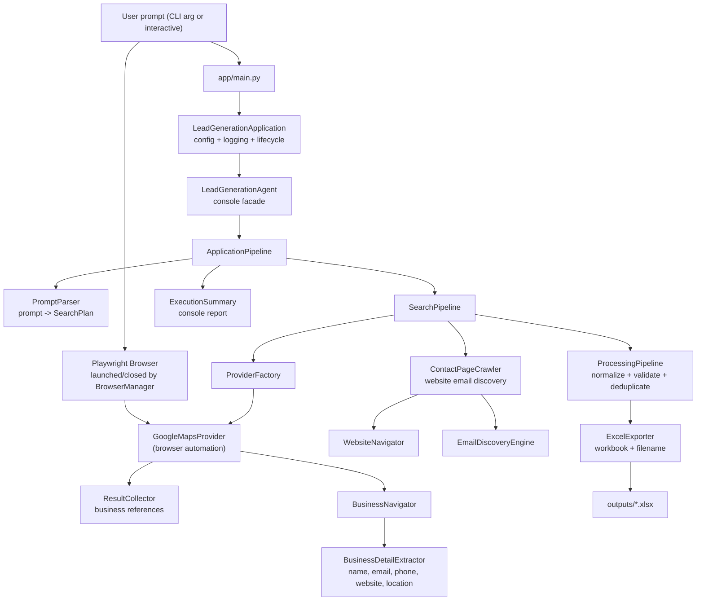

# Lead Generation Agent

An AI-powered agent that turns a single natural-language prompt — such as
**"software companies in Karachi"** — into a ready-to-use Excel lead list.

The agent parses the prompt, drives a real browser (Playwright) to search
business listing websites, extracts contact details for each business,
cleans and deduplicates the data, and exports everything to a formatted
`.xlsx` workbook — all with graceful handling of missing data and a clear
execution summary at the end.

All 14 assignment requirements are implemented and covered by an automated
test suite (unit, integration, end-to-end, requirement, and performance).

## Features

- **Natural-language input** — describe what to search for and where; no
  manual field entry required (`app/parser`).
- **Browser automation** — Playwright drives a real Chromium instance, so no
  API keys or subscription services are needed (`app/browser`).
- **Modular search providers** — Google Maps is implemented out of the box;
  Bing Maps, Yellow Pages, and Yelp slots are reserved and swappable
  (`app/providers`).
- **Five contact fields** — business name, email, phone number, website, and
  location are collected whenever available (`app/extractor`).
- **Email enrichment** — when a business has a website, the agent crawls it
  (including contact/about pages) to discover an email address.
- **Configurable volume** — collect 10, 25, 50, or 100+ leads via `MAX_LEADS`.
- **Robust data handling** — missing fields become empty strings, unusable
  records are skipped, and duplicates are removed; one failure never aborts
  the run (`app/processing`).
- **Excel export** — a formatted `.xlsx` workbook with a meaningful,
  collision-safe filename such as `leads_software_companies_Karachi.xlsx`
  (`app/exporter`).
- **Execution summary** — a boxed console report shows the query, counts,
  output file, and elapsed time.
- **Logging** — console plus a rotating file log (`logs/application.log`).

## How It Works

1. **Parse** — the natural-language prompt is turned into a structured
   `SearchPlan` (business type, location, provider, max results).
2. **Search** — the provider opens the listing site and collects business
   references, scrolling the results feed as needed.
3. **Extract** — each business page is opened and its name, email, phone,
   website, and location are extracted defensively.
4. **Enrich** — businesses with a website are crawled for an email address
   (homepage first, then contact/about pages).
5. **Process** — leads are normalized, validated, and deduplicated.
6. **Export** — the final leads are written to a formatted `.xlsx` workbook.
7. **Summarize** — a console summary reports what was collected and where it
   was saved.

A failure at any stage — an unavailable website, a provider outage, a
write-protected directory — is contained: already-collected data is preserved
and the application never crashes with a runtime error.

## Architecture

The application follows a layered, single-responsibility design. Each layer is
injectable and independently testable.



- **`app/main.py`** — entry point only; passes the prompt through.
- **`app/application`** — application lifecycle: configuration, logging,
  clean startup and shutdown.
- **`app/agent`** — console-facing agent facade.
- **`app/parser`** — deterministic prompt-to-`SearchPlan` parsing.
- **`app/browser`** — Playwright lifecycle (launch, context, page, close).
- **`app/providers`** — search providers, registry, factory, result collector.
- **`app/extractor`** — business detail extraction and website email discovery.
- **`app/processing`** — normalization, validation, deduplication.
- **`app/exporter`** — Excel workbook construction and output file handling.
- **`app/models`** — `Lead`, `SearchPlan`, `BusinessReference`,
  `ExecutionResult`, and related types.
- **`app/config`** — environment-driven settings, constants, and logging.
- **`app/utils`** — helpers and the execution summary renderer.
- **`app/exceptions`** — a single exception hierarchy rooted at
  `LeadGenerationError`.

## Folder Structure

```
lead-generation-agent/
├── app/
│   ├── main.py                    # Application entry point
│   ├── application/               # Lifecycle orchestration
│   ├── agent/                     # Console-facing agent facade
│   ├── parser/                    # Natural-language prompt parsing
│   ├── browser/                   # Playwright lifecycle management
│   ├── providers/                 # Search providers and result collection
│   ├── extractor/                 # Business detail and email extraction
│   ├── processing/                # Normalization, validation, deduplication
│   ├── exporter/                  # Excel (.xlsx) export
│   ├── models/                    # Lead, SearchPlan, ExecutionResult
│   ├── config/                    # Settings, constants, logging
│   ├── utils/                     # Helpers, execution summary
│   └── exceptions/                # Custom exception hierarchy
├── tests/                         # pytest suite (unit, integration, E2E,
│                                  # requirement, performance)
├── docs/                          # Architecture, requirement compliance,
│                                  # project summary, submission checklist
├── outputs/                       # Generated Excel workbooks
├── logs/                          # Rotating application logs
├── requirements.txt               # Runtime dependencies
├── pyproject.toml                 # Packaging, tooling, pytest config
├── .env.example                   # Environment variable template
├── .gitignore
└── README.md
```

## Installation

Requires **Python 3.12 or newer**.

```bash
# 1. Create and activate a virtual environment
python -m venv .venv

# Windows
.venv\Scripts\activate
# Linux / macOS
source .venv/bin/activate

# 2. Install runtime dependencies
pip install -r requirements.txt

# 3. Install the Playwright browser used for automation
playwright install chromium
```

Optional development tooling (Black, Ruff, pytest):

```bash
pip install -e ".[dev]"
```

## Setup & Configuration

Copy the environment template and adjust values if needed:

```bash
cp .env.example .env
```

| Variable          | Description                                     | Default     |
| ----------------- | ----------------------------------------------- | ----------- |
| `HEADLESS`        | Run the browser in headless mode                | `true`      |
| `TIMEOUT`         | Default browser timeout in milliseconds         | `30000`     |
| `MAX_LEADS`       | Maximum number of leads to collect              | `25`        |
| `SEARCH_PROVIDER` | Search provider name                            | `google`    |
| `BROWSER_TYPE`    | Browser engine (`chromium`, `firefox`, `webkit`)| `chromium`  |
| `OUTPUT_DIR`      | Directory for generated workbooks               | `outputs`   |
| `LOG_DIR`         | Directory for log files                         | `logs`      |
| `LOG_LEVEL`       | Logging verbosity (`CRITICAL`…`DEBUG`)          | `INFO`      |

Supported `SEARCH_PROVIDER` values: `google`, `google_maps` (implemented),
plus `bing_maps`, `yellow_pages`, and `yelp` (reserved provider slots).

Configuration is validated on startup. Invalid values — a non-positive
`TIMEOUT`/`MAX_LEADS`, an unsupported provider, or an unknown `LOG_LEVEL` —
abort the application with a clear error message. Output and log directories
are created automatically if they do not exist.

## Running

Pass a prompt as a command-line argument:

```bash
python app/main.py "software companies in Karachi"
```

Without an argument, the application asks for the search interactively:

```bash
python app/main.py
```

Example prompts:

- `coffee shops in America`
- `dentists in Lahore`
- `software companies in Karachi`
- `marketing agencies in Dubai`
- `plumbers in New York`

Expected console output:

```
INFO  Application starting...
INFO  Loading configuration...
INFO  Logging initialized.
Lead Generation Agent v0.1.0 is ready to use.

Search Plan
========================================
Original Prompt: software companies in Karachi
Business Type: software companies
Location: Karachi
Provider: google
Maximum Leads: 25

========================================
Lead Generation Completed Successfully
========================================
Search Query: software companies in Karachi
Business Type: software companies
Location: Karachi
Provider: Google
Businesses Found: 8
Documents Removed: 1
Leads Exported: 7
Output File: C:\...\outputs\leads_software_companies_Karachi.xlsx
Execution Time: 12.3 seconds
========================================
INFO  Application shutting down...
```

## Output & Logs

- **Excel workbook** — saved to `OUTPUT_DIR` with a meaningful filename
  (`leads_<business_type>_<location>.xlsx`). If the file already exists a
  timestamp is appended so previous exports are never overwritten. The
  workbook opens in Excel with a single `Leads` sheet containing the columns:
  Business Name, Email, Phone Number, Website, Location, Provider,
  Search Query, Collected At, and Source URL.
- **Log file** — all records are mirrored to `LOG_DIR/application.log`,
  rotated at 5 MB with 3 backups.

## Testing & Quality

```bash
pytest                  # run the full test suite
ruff check app tests    # lint
black --check app tests # formatting check
```

The suite is organized into unit, integration, end-to-end, requirement, and
performance groups. End-to-end tests inject a fake provider, so they never
touch the network or launch a real browser; only the browser-automation tests
and the Requirement 3 check launch real Chromium. The 14-requirement
verification matrix runs with:

```bash
pytest tests/test_requirement_matrix.py -v
```

See `docs/REQUIREMENT_COMPLIANCE.md` for the requirement-by-requirement
compliance table.

## Troubleshooting

| Symptom                                                        | Likely cause                                              | Fix                                                                  |
| -------------------------------------------------------------- | --------------------------------------------------------- | -------------------------------------------------------------------- |
| `Playwright executable doesn't exist` or browser launch fails  | Chromium not installed                                    | Run `playwright install chromium`                                    |
| `Could not determine a location for prompt`                    | Prompt has no `in`/`near`/`around` separator              | Use a prompt like `"software companies in Karachi"`                  |
| `SEARCH_PROVIDER must be one of ...`                           | Invalid provider name in `.env`                           | Set `SEARCH_PROVIDER=google` or another supported value               |
| No leads collected                                             | Search returned no results or provider was blocked        | Check the log file; increase `TIMEOUT`; retry                         |
| A business has blank email/phone/website                       | The field is genuinely unavailable on the page            | Expected behavior — missing fields are stored as empty strings        |
| Output file is timestamped                                     | A file with the same name already exists                  | Expected behavior — previous exports are never overwritten            |
| Slow runs                                                      | Real browser automation against live websites             | Reduce `MAX_LEADS`; increase `TIMEOUT` only if pages time out         |

Logs in `logs/application.log` contain the full trace of every stage and are
the first place to look when diagnosing unexpected behavior.

## Requirements Compliance

All 14 project requirements are implemented and verified by automated tests.
The compliance matrix (requirement, status, implementing module, and evidence)
lives in `docs/REQUIREMENT_COMPLIANCE.md`, with the verification details in
`docs/REQUIREMENT_VERIFICATION.md`.

## Future Improvements

- Implement the reserved Bing Maps, Yellow Pages, and Yelp providers.
- Parallel scraping across multiple providers to speed up large collections.
- Proxy rotation and CAPTCHA handling for resilient, large-scale scraping.
- Alternative exports (CSV, Google Sheets) and CRM integrations.
- AI-powered lead scoring, company-size data, and LinkedIn/social enrichment.
- Stronger email verification (DNS/MX checks) beyond structural validation.
- A richer parsing layer (spaCy NER or an LLM) for complex prompts.

## License

MIT
